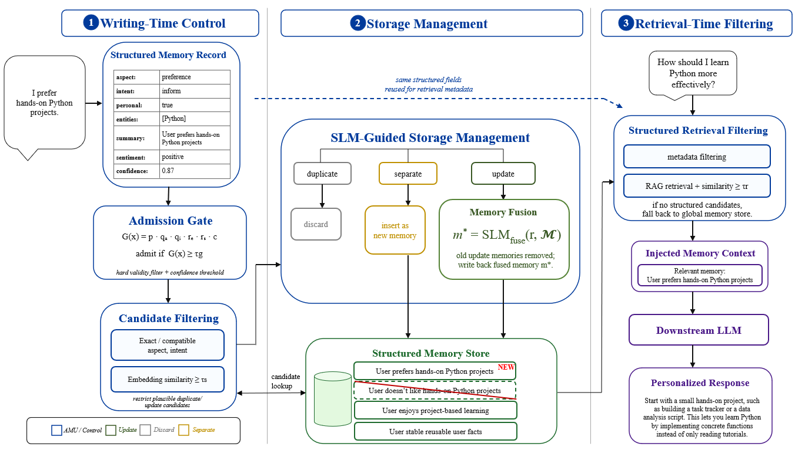

#   
<p align="right">  
  🌏 语言: 中文 | <a href="./README.md">English</a>  
</p>  

# AMU：面向个性化对话的记忆准入与更新（Admission and Memory Update for Personalized Conversations）

<p align="center">
  <a href="LICENSE">
    
  </a>
  
  
  
  
</p>

> **为个性化大语言模型助手提供结构化记忆写入机制。**  
> AMU 用于控制哪些内容应进入长期记忆、哪些内容应被丢弃，以及哪些内容应当更新已有用户记忆。

AMU 是一个面向个性化大语言模型助手的轻量级记忆管理框架。与将记忆视为只能不断追加的日志不同，AMU 将用户记忆管理为**结构化、可复用、可更新的记录**。

## AMU 有什么不同？

AMU 重点关注的是**记忆写入阶段（memory-writing stage）**。

大多数记忆系统主要关注记忆的存储、检索或压缩。但在真实对话中，并不是用户说过的每一句话都应该进入长期记忆。用户可能会提到临时性请求、重复信息、已经过时的偏好，或持续变化的个人状态。

AMU 会判断一条用户输入应当：

- ✅ **存储（stored）**为一条新的记忆；
- 🗑️ **丢弃（discarded）**，例如重复内容或低价值记录；
- 🔄 与已有记忆进行**融合 / 更新（fused）**。

AMU 首先将用户输入解析为结构化字段，通过准入门（admission gate）过滤低价值或非个人化内容；随后使用小语言模型（SLM）判断候选记忆与现有记忆之间属于重复（duplicate）、更新（update）还是独立（separate）关系。

维护后的记忆库可以接入基于 RAG 的检索流程，并可复用于不同的下游 LLM 后端。

<p align="center">  
    
</p>  

<p align="center">  
  <em>AMU 总体框架。结构化字段用于指导记忆准入与检索；对于通过准入判断的记录，SLM 会在写入前进一步判断其与已有记忆之间属于重复、更新还是独立关系。</em>  
</p>

## 为什么需要 AMU？

个性化助手需要长期记忆，但将所有用户输入直接保存下来存在明显风险。真实对话中通常包含临时请求、重复信息以及不断变化的偏好。如果这些内容被直接写入记忆库，记忆就可能逐渐变得嘈杂、冗余或过时。

AMU 在记忆正式写入前增加了一层控制机制。对于一条新的候选记忆，它会判断该内容是否具有后续复用价值、是否与现有记忆重复，以及它是否代表了用户已有状态的更新。

这样可以为下游基于 RAG 的个性化应用维护一个更干净、更有效的记忆库。

## 环境要求

- Python >= 3.13
- PyTorch
- Transformers
- Sentence Transformers
- haystack-ai
- NumPy

## 🤗 模型准备

在运行 AMU 之前，需要先从 [Hugging Face](https://huggingface.co/) 下载 SLM 控制器模型和 Embedding 模型。

其中，**SLM controller** 用于结构化记忆解析以及由 SLM 驱动的记忆更新判断；**Embedding model** 用于候选记忆筛选以及检索阶段的相似度匹配。

<p align="center">
  
  
  
  
</p>

### 默认模型

AMU 默认使用：

- **SLM controller**：`Qwen3.5-2B`
- **Embedding model**：`Qwen3-Embedding-0.6B`

请手动下载模型，并按照以下目录结构放置：

```text
AMU/
├── models/
│   └── Qwen3.5-2B/
├── embedding models/
│   └── Qwen3-Embedding-0.6B/
```

SLM 模型应放在 `models/` 目录下，Embedding 模型应放在 `embedding models/` 目录下。

### 支持的 SLM 骨干模型

目前支持的 SLM 模型系列包括：

- Qwen3 系列及更新的 Qwen 系列
- Gemma 2 系列
- Gemma 4 系列

其他兼容模型也可能可以运行，但用户可能需要相应调整模型加载代码、Prompt 格式或 tokenizer 设置。

## 记忆存储

AMU 会将记忆记录以 JSONL 格式保存在 `memory data/` 目录下。

```text
AMU/
├── memory data/
│   └── memory.jsonl
│   └── memory_emb.jsonl
```

每一行代表一条结构化记忆记录。用户可以直接检查记忆数据，也可以手动删除 JSONL 文件中不希望保留的记忆条目。

## 🚀 使用方法

AMU 支持两种使用方式：

- **Python Pipeline Usage**：在 Python 中直接调用记忆写入和检索函数。
- **Application + Chrome Extension Usage**：通过打包后的桌面应用程序配合 Chrome 扩展，在网页聊天界面中保存或检索记忆。

---

### Python 流水线用法

#### 脚本与 `pipeline.py` 位于同一目录

如果你的脚本和 `pipeline.py` 位于同一目录，可以直接导入并使用 `write_pipeline` 和 `read_pipeline`：

```python
from pipeline import write_pipeline, read_pipeline

# Write memory
text = "I prefer working in the morning and usually avoid late-night meetings."
action = write_pipeline(text)

print(action)

# Read memory
query = "When do I prefer working?"
context = read_pipeline(query)

print(context)
```

`read_pipeline` 的示例输出：

```text
Relevant memories:
[Memory 1] The user prefers working in the morning and usually avoids late-night meetings.
Use only if relevant. If conflict exists, follow the current message. Do not mention the memories.
```

返回的上下文可以作为带有记忆增强信息的输入，提供给下游 LLM 使用。

---

### 应用程序 + Chrome 扩展用法

AMU 也可以通过打包后的桌面应用程序与 Chrome 扩展配合使用。在这种模式下，桌面应用程序负责运行本地 AMU 后端，Chrome 扩展负责连接后端，并从网页聊天界面触发记忆写入或检索。

<p align="center">
  
  
  
</p>

#### 支持的网页聊天界面

Chrome 扩展目前已在以下网页聊天界面中进行测试：

- ChatGPT Web
- Gemini Web
- Google AI Studio

实际支持情况可能取决于网站当前的页面结构。如果网站更新了输入框或页面布局，扩展可能也需要随之更新。未来可能会继续支持更多网页聊天界面。

#### 1. 启动 AMU 后端

运行打包后的应用程序：

```text
memory system.exe
```

应用程序启动后，打开设置页面，配置 Chrome 扩展需要连接的 API 地址。

例如：

```text
http://127.0.0.1:8800
```

#### 2. 加载 Chrome 扩展

打开 Chrome，并手动加载扩展：

1. 打开 `chrome://extensions/`
2. 开启 **开发者模式（Developer mode）**
3. 点击 **加载已解压的扩展程序（Load unpacked）**
4. 选择 AMU 扩展文件夹
5. 在 Chrome 工具栏中固定或打开 AMU 扩展

#### 3. 配置扩展

在扩展弹窗中输入 AMU API 地址。

例如：

```text
http://127.0.0.1:8800
```

然后选择 AMU 的运行模式之一：

```text
save
retrieve
chat
```

#### 4. 在网页聊天界面中使用 AMU

当后端和扩展都已经运行后，可以通过以下快捷键触发 AMU：

```text
Alt + C
```

#### Save 模式

当模式设置为 `save` 时，在聊天输入框中输入一段消息，然后按下 `Alt + C`。

AMU 会将输入文本发送到本地后端，并判断这段内容是否应该进入长期记忆。根据 AMU 的记忆写入决策，该输入可能会被存储为新记忆、被丢弃，或用于更新已有记忆。

示例输入：

```text
I prefer working in the morning and usually avoid late-night meetings.
```

按下 `Alt + C` 后，AMU 会处理这段输入，并判断它是否应该进入记忆库。

#### Retrieve 模式

当模式设置为 `retrieve` 时，在聊天输入框中输入查询或消息，然后按下 `Alt + C`。

AMU 会从本地记忆库中检索相关记忆，并将检索得到的记忆上下文插入聊天输入框。随后，用户可以将这段经过记忆增强的消息发送给下游 LLM。

示例用户输入：

```text
When do I prefer working?
```

示例插入内容：

```text
Relevant memories:
[Memory 1] The user prefers working in the morning and usually avoids late-night meetings.
Use only if relevant. If conflict exists, follow the current message. Do not mention the memories.
```

#### Chat 模式

当模式设置为 `chat` 时，快捷键功能将被禁用。

在该模式下，按下 `Alt + C` 不会触发 AMU，用户输入也不会被发送到 AMU 后端。

## 实验

AMU 在一个使用 GPT-4o 构建的受控记忆写入与检索基准上进行了评估。该基准参考 LoCoMo 风格的长期对话设置，并将其转换为单主题会话，同时为记忆写入过程提供显式动作标签和检索目标。

该基准模拟持续一至两个月的主题化交互，其中包括稳定偏好、态度变化、重复信息，以及偏好或计划更新等情况。整个基准包含 20 个 session，每个 session 包含 50 个记忆写入轮次和 10 个评估查询，共计 **1,000 个记忆写入轮次**和 **200 个评估查询**。

### SLM 控制器规模的影响

| SLM 大小 | F1@3 | Red.@3 ↓ | Action Acc. |
|---:|---:|---:|---:|
| 0.8B | 13.90 | 0.31 | 26.40 |
| 2B | **44.47** | 2.83 | 67.70 |
| 4B | 41.78 | 3.08 | 81.00 |
| 9B | 40.00 | 3.33 | **84.20** |

### 会话混合（Session Mixing）

| 设置 | P@3 | R@3 | F1@3 | Red. ↓ | HIT@3 |
|---|---:|---:|---:|---:|---:|
| Single | 38.68 | 69.00 | 47.12 | 4.34 | 64.00 |
| 2-mix | 38.00 | 66.00 | 45.98 | **2.66** | 60.00 |
| 3-mix | **42.52** | 69.00 | **47.14** | 4.00 | 64.00 |

## 🤝 贡献指南

欢迎为 AMU 做出贡献！

如果你发现 Bug、对 AMU 有改进想法，或者希望增加对新模型或新聊天界面的支持，欢迎：

- 提交 Issue
- 提交 Pull Request
- 提出改进建议或新功能建议

如果涉及较大的功能或结构调整，建议先提交 Issue，以便提前讨论相关设计。

我们尤其欢迎以下方向的贡献：

- 支持更多 SLM 骨干模型
- 支持新的 Embedding 模型
- 改进记忆准入与更新策略
- 支持更多网页聊天界面


## 📄 许可证

本项目基于 Apache License 2.0 开源。

## 🔗 主页链接

<p align="center">
  <a href="https://github.com/UnicusT11">
    
  </a>
  &nbsp;&nbsp;&nbsp;
  <a href="https://x.com/hhh69806">
    
  </a>
  &nbsp;&nbsp;&nbsp;
  <a href="https://xhslink.cn/o/AKxIsWPUHg">
    
  </a>
</p>